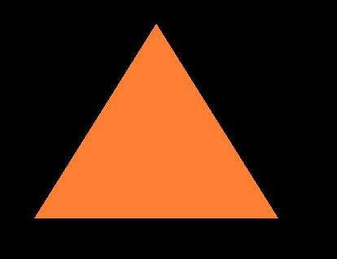
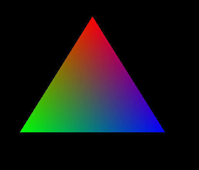
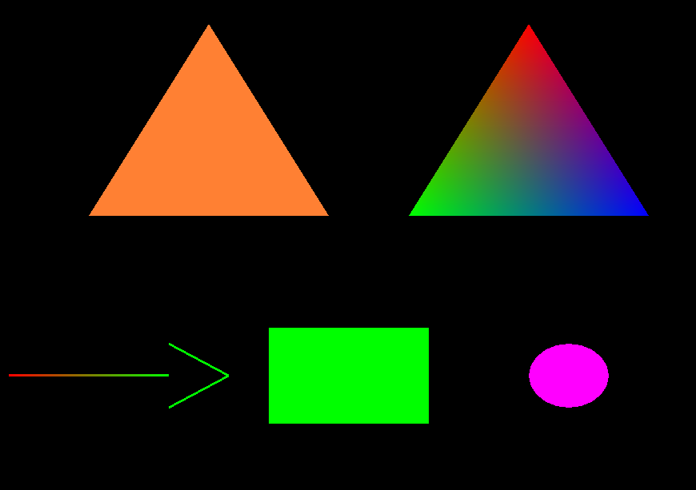

## OPENGL入门

### 入口API解读
- glutInit 初始化
- glutInitDisplayMode 基本的显示模式
-	glutInitWindowPosition 显示的时候距离电脑屏幕窗口的距离
- glutInitWindowSize 初始化的窗口大小
- glutCreateWindow 所创建的窗口名称
- glutDisplayFunc选择渲染的函数
- glutMainLoop 循环 不让程序关闭

  ```c++
  glutInit(&argc, argv);
  glutInitDisplayMode(GLUT_RGB | GLUT_SINGLE);
  glutInitWindowPosition(100, 50);
  glutInitWindowSize(1000, 800);
  glutCreateWindow("opengl");
  glutDisplayFunc(&display);
  glutMainLoop();
  ```

### 图形画法
- glColor3ub 设置当前图画显示颜色
- glBegin 开始点渲染(参数为点渲染模式 即要那这些点干什么)
-  glVertex2f 画出一个点

### 三角行
基本思路： 画出三个点即可，利用三角形连线模式即可
```c++
glColor3ub(255, 128, 51);
glBegin(GL_TRIANGLES);
glVertex2f(-0.4, 0.6);
glVertex2f(-0.1, 0);
glVertex2f(-0.7, 0);
glEnd();
```
效果:  



### 顶点着色三角形

基本思路：直接给每个点设置一个意思即可，opengl默认会在点和点之间利用渐变色填充

```c++
	//task2
	glBegin(GL_TRIANGLES);
	glColor3ub(255, 0, 0);
	glVertex2f(0.4, 0.6);
	glColor3ub(0, 255, 0);
	glVertex2f(0.1, 0);
	glColor3ub(0, 0, 255);
	glVertex2f(0.7, 0);
	glEnd();
```


###　其他项:
思路基本差不多， 这里直接上效果图



